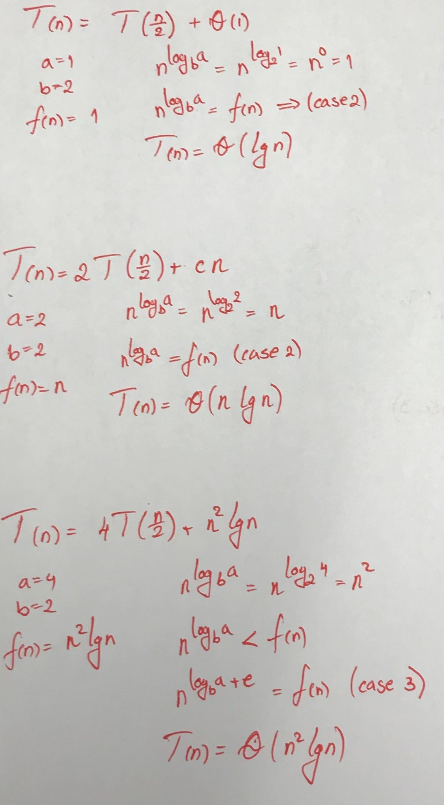
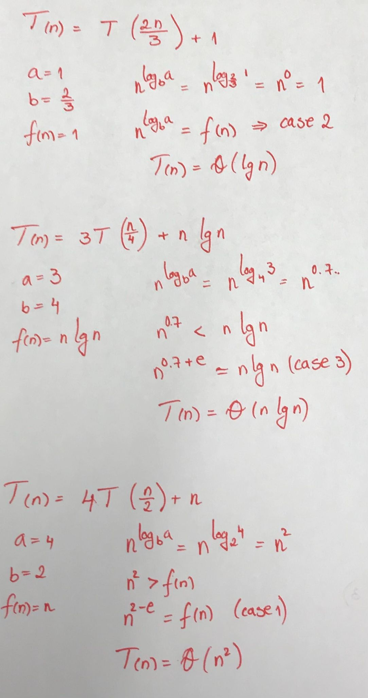

In this method, the recurrences are solved in the following form:

T(n) = aT(n-b) + f(n)

where a>= 1, b>= 1 are the constraints and f(n) is an asymptotically positive function. 

The reccurence describes the running time of an algorithm that **divides a problem of size n into a subroblems , each of size n/b.**

The **a subproblems** are solved recursively, each in time T(n/b).

f(n) represents a function that defines the cost of dividing the problem and combining results of the subproblems

Rules:

1. If f(n) = O(n^log_b(a-e)) for some constant e > 0, then T(n) = Θ(n^log_b(a))
2. If f(n) = O(n^log_b(a)), then T(n) = Θ(n^log_b(a)* lg(n))
3. If f(n) = O(n^log_b(a+e)) for some constant e > 0, then T(n) = f(n)

&nbsp;&nbsp;&nbsp;&nbsp;&nbsp;&nbsp;&nbsp;&nbsp;&nbsp;&nbsp;&nbsp;&nbsp;&nbsp;&nbsp;&nbsp;&nbsp;&nbsp;&nbsp; 
&nbsp;&nbsp;&nbsp;&nbsp;&nbsp;&nbsp;&nbsp;&nbsp;&nbsp;&nbsp;&nbsp;&nbsp;&nbsp;&nbsp;&nbsp;&nbsp;&nbsp;&nbsp; 
&nbsp;&nbsp;&nbsp;&nbsp;&nbsp;&nbsp;&nbsp;&nbsp;&nbsp;&nbsp;&nbsp;&nbsp;&nbsp;&nbsp;&nbsp;&nbsp;&nbsp;&nbsp; 

&nbsp;&nbsp;&nbsp;&nbsp;&nbsp;&nbsp;&nbsp;&nbsp;&nbsp;&nbsp;&nbsp;&nbsp;&nbsp;&nbsp;&nbsp;&nbsp;&nbsp;&nbsp; 
&nbsp;&nbsp;&nbsp;&nbsp;&nbsp;&nbsp;&nbsp;&nbsp;&nbsp;&nbsp;&nbsp;&nbsp;&nbsp;&nbsp;&nbsp;&nbsp;&nbsp;&nbsp; 
&nbsp;&nbsp;&nbsp;&nbsp;&nbsp;&nbsp;&nbsp;&nbsp;&nbsp;&nbsp;&nbsp;&nbsp;&nbsp;&nbsp;&nbsp;&nbsp;&nbsp;&nbsp; 

