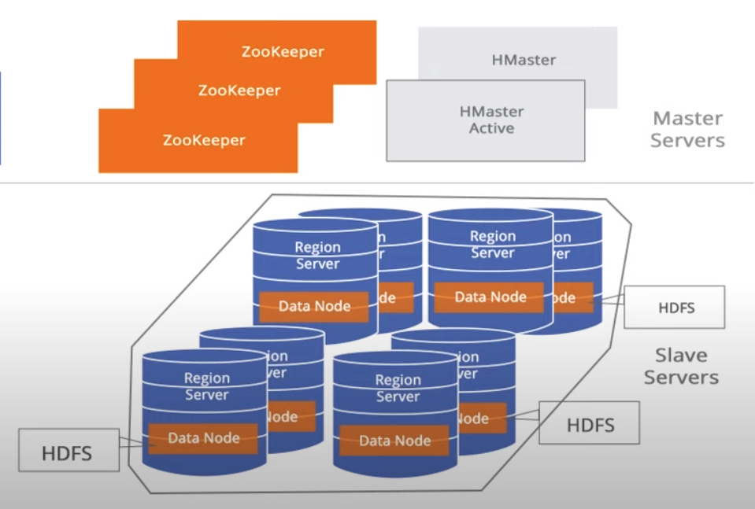
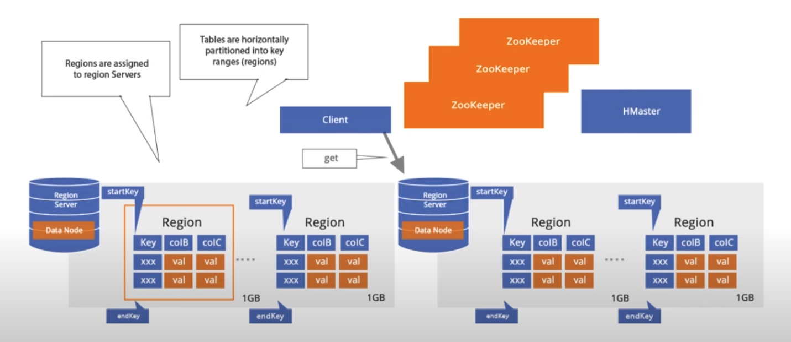
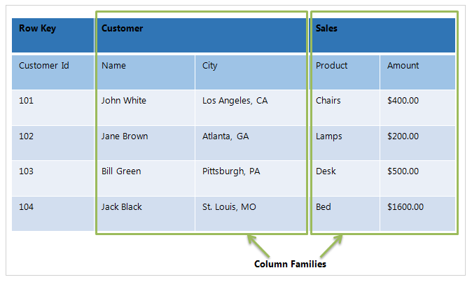
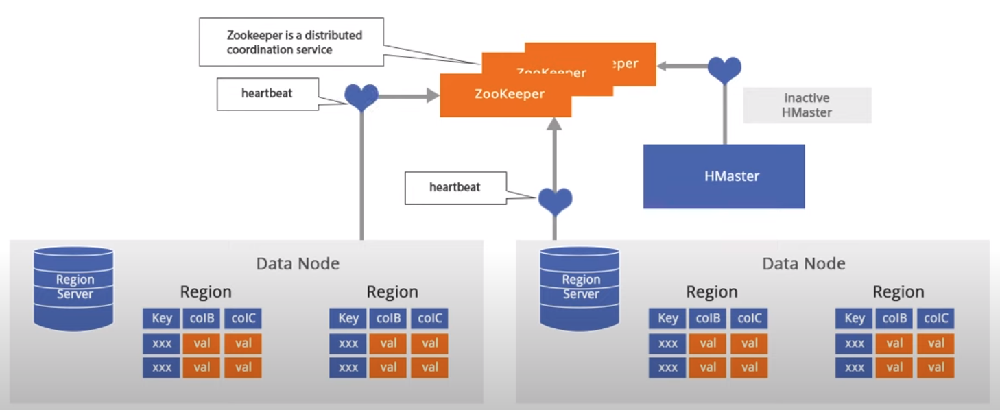
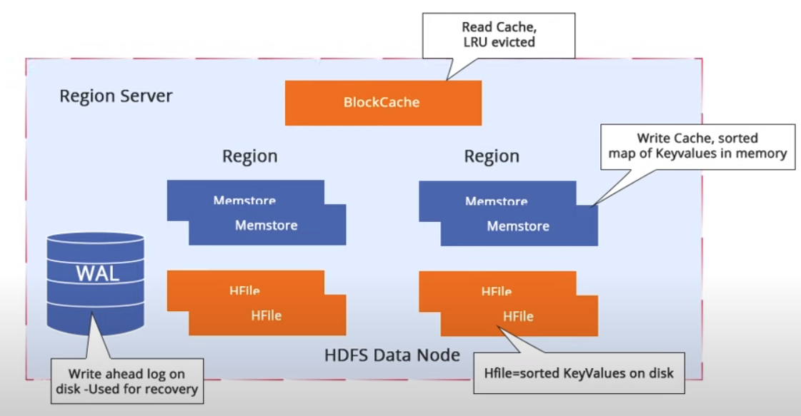

 
 **HBase** is a database management system that rests on top of the HDFS (Hadoop) and enables real time analysis of data. In other words, this is a Hadoop database. It is modeled based after Google's Bogtable and it is used when random, real-time read/write access is needed for Big Data. 
 
 It can store a huge amount of data in a tabular format for extremly fast reads and writes. 
 
 HBase is a type of NoSQL database and it is classified as a key-value store. Some characteristics are:
        
 - Value is identified with a key
 - Key and Value are ByteArray type
 - Values are stored in key-orders 
 
 Hbse is a database in which tables have no schema. At the time of table creation, column families are defined, not columns.
 
# NoSQL Database

 NoSQL is a form of unstructured data and it contains a wide variety of different types of data. On the other hand, RDBMS contains structured data that is heavily dependent on rows, columns, and tables. 
 
 
 Types of NoSQL:
 
   - Key Value database (containts a big hash table of keys and values - Oracle NoSQL,Scalaris)
   - Document-based database (stores documents made up of tagged elements - MongoDB, CouchDB, OrientDB, RavenDB)
   - Column-based database (each storage block contains data from only one column - BigTable, Cassandra, HBase, Hypertable)
   - Graph-based database (network database that uses nodes to represent and store data - Neo4j, Infinite Graph, FlockDB)
      
&nbsp;&nbsp;&nbsp;&nbsp;&nbsp;&nbsp;&nbsp;&nbsp;&nbsp;&nbsp;&nbsp;&nbsp;&nbsp;&nbsp;&nbsp;&nbsp;&nbsp;&nbsp; 

&nbsp;&nbsp;&nbsp;&nbsp;&nbsp;&nbsp;&nbsp;&nbsp;&nbsp;&nbsp;&nbsp;&nbsp;&nbsp;&nbsp;&nbsp;&nbsp;&nbsp;&nbsp;&nbsp;&nbsp;&nbsp;&nbsp;&nbsp;&nbsp;&nbsp;&nbsp;&nbsp;&nbsp;&nbsp;&nbsp;&nbsp;&nbsp;&nbsp;&nbsp;&nbsp;&nbsp;&nbsp;&nbsp;&nbsp;&nbsp;&nbsp;&nbsp;&nbsp;&nbsp;&nbsp;&nbsp;&nbsp;&nbsp;&nbsp;&nbsp;&nbsp;&nbsp;&nbsp;&nbsp;&nbsp;&nbsp;&nbsp;&nbsp;&nbsp;*Figure 1 - Types of NoSQL*

# HBase Architecture

 HBase contains 2 types of nodes - **Master node and RegionServer nodes.** There is only one master node running at the time, whereas there can be one or more region servers. The high availability is maintained by a **service for distributed systems called Zookeeper**. 
 
 The master node manages cluster operations such as *creation and deletion of tables, assignment, load balancing, and splitting.* 
 
 On the other side, there can be one or more RegionServers running at a time, while hosting tables, performing *read and writes* of data. Every RegionServer acts as a slave, and every RegionServer Node communicates with the master node. 
 
 The actual data is stored in RegionServers in a form of files known as HFiles, which are optimized files for the storage of data.
 
 **Zookeeper** performs the distribution coordination. 
 
 &nbsp;&nbsp;&nbsp;&nbsp;&nbsp;&nbsp;&nbsp;&nbsp;&nbsp;&nbsp;&nbsp;&nbsp;&nbsp;&nbsp;&nbsp;&nbsp;&nbsp;&nbsp; 

&nbsp;&nbsp;&nbsp;&nbsp;&nbsp;&nbsp;&nbsp;&nbsp;&nbsp;&nbsp;&nbsp;&nbsp;&nbsp;&nbsp;&nbsp;&nbsp;&nbsp;&nbsp;&nbsp;&nbsp;&nbsp;&nbsp;&nbsp;&nbsp;&nbsp;&nbsp;&nbsp;&nbsp;&nbsp;&nbsp;&nbsp;&nbsp;&nbsp;&nbsp;&nbsp;&nbsp;&nbsp;&nbsp;&nbsp;&nbsp;&nbsp;&nbsp;&nbsp;&nbsp;&nbsp;&nbsp;&nbsp;&nbsp;&nbsp;&nbsp;&nbsp;&nbsp;&nbsp;&nbsp;&nbsp;&nbsp;&nbsp;&nbsp;&nbsp;*Figure 2 - HBase Architecture*

 The data in HBase table is divided *horizontally* accross different regions. In other words, a **Region** in HBase is *a subset of a table's rows. These regions are sorted accross different RegionServeers, where 1 RegionServer can serve thousands of regions. Let's see how that looks like:
 
  &nbsp;&nbsp;&nbsp;&nbsp;&nbsp;&nbsp;&nbsp;&nbsp;&nbsp;&nbsp;&nbsp;&nbsp;&nbsp;&nbsp;&nbsp;&nbsp;&nbsp;&nbsp; 

&nbsp;&nbsp;&nbsp;&nbsp;&nbsp;&nbsp;&nbsp;&nbsp;&nbsp;&nbsp;&nbsp;&nbsp;&nbsp;&nbsp;&nbsp;&nbsp;&nbsp;&nbsp;&nbsp;&nbsp;&nbsp;&nbsp;&nbsp;&nbsp;&nbsp;&nbsp;&nbsp;&nbsp;&nbsp;&nbsp;&nbsp;&nbsp;&nbsp;&nbsp;&nbsp;&nbsp;&nbsp;&nbsp;&nbsp;&nbsp;&nbsp;&nbsp;&nbsp;&nbsp;&nbsp;&nbsp;&nbsp;&nbsp;&nbsp;&nbsp;&nbsp;&nbsp;&nbsp;&nbsp;&nbsp;&nbsp;&nbsp;&nbsp;&nbsp;*Figure 3 - Region Servers & Regions*

 - Every region is sorted according to the **key**, and the content of the region is specified by the **start key & end key**.
 
HBase is a Key-Value database where the value is the set of column families with the key being a unique identifier of the records. 

The Data Model in HBase is designed to accommodate semi-structured data that could vary in field size, data type and columns. Additionally, the layout of the data model makes it easier to partition the data and distribute it across the cluster. The Data Model in HBase is made of different logical components such as Tables, Rows, Column Families, Columns, Cells and Versions.

  &nbsp;&nbsp;&nbsp;&nbsp;&nbsp;&nbsp;&nbsp;&nbsp;&nbsp;&nbsp;&nbsp;&nbsp;&nbsp;&nbsp;&nbsp;&nbsp;&nbsp;&nbsp; 

Tables – The HBase Tables are more like logical collection of rows stored in separate partitions called Regions. As shown above, every Region is then served by exactly one Region Server. The figure above shows a representation of a Table.

Rows – A row is one instance of data in a table and is identified by a rowkey. Rowkeys are unique in a Table and are always treated as a byte[].

Column Families – Data in a row are grouped together as Column Families. Each Column Family has one more Columns and these Columns in a family are stored together in a low level storage file known as HFile. Column Families form the basic unit of physical storage to which certain HBase features like compression are applied. Hence it’s important that proper care be taken when designing Column Families in table.

The table above shows Customer and Sales Column Families. The Customer Column Family is made up 2 columns – Name and City, whereas the Sales Column Families is made up to 2 columns – Product and Amount.

Columns – A Column Family is made of one or more columns. A Column is identified by a Column Qualifier that consists of the Column Family name concatenated with the Column name using a colon – example: columnfamily:columnname. There can be multiple Columns within a Column Family and Rows within a table can have varied number of Columns.

Cell – A Cell stores data and is essentially a unique combination of rowkey, Column Family and the Column (Column Qualifier). The data stored in a Cell is called its value and the data type is always treated as byte[].

Version – The data stored in a cell is versioned and versions of data are identified by the timestamp. The number of versions of data retained in a column family is configurable and this value by default is 3.

Every RegionServer sends its **heartbeats** to the ZooKeeper as well as HMaster so ZooKeeper can maintain which among them are active or inactive.

 *Note: there may be more HMaster nodes for the case if one fails, it does not affect the rest of the nodes.*
 
 &nbsp;&nbsp;&nbsp;&nbsp;&nbsp;&nbsp;&nbsp;&nbsp;&nbsp;&nbsp;&nbsp;&nbsp;&nbsp;&nbsp;&nbsp;&nbsp;&nbsp;&nbsp; 

&nbsp;&nbsp;&nbsp;&nbsp;&nbsp;&nbsp;&nbsp;&nbsp;&nbsp;&nbsp;&nbsp;&nbsp;&nbsp;&nbsp;&nbsp;&nbsp;&nbsp;&nbsp;&nbsp;&nbsp;&nbsp;&nbsp;&nbsp;&nbsp;&nbsp;&nbsp;&nbsp;&nbsp;&nbsp;&nbsp;&nbsp;&nbsp;&nbsp;&nbsp;&nbsp;&nbsp;&nbsp;&nbsp;&nbsp;&nbsp;&nbsp;&nbsp;&nbsp;&nbsp;&nbsp;&nbsp;&nbsp;&nbsp;&nbsp;&nbsp;&nbsp;&nbsp;&nbsp;&nbsp;&nbsp;&nbsp;&nbsp;&nbsp;&nbsp;*Figure 4 - Communication Inside HBase*
 
 Another very important concept is a **Meta Table** that contains the information about in which RegionServer, the  *StartKey* and *EndKey* can be found. This is important becausae if you did not have the meta table, you would have to scan every region of particular table to get the desired data. On the other side, if you wanted to get some data for a particular key and if you had meta table, you could directly go to the specified region server. 
 
 **Get** - operation performed by client to read a specific entry from the HBase table.  
 
 **Put** - operation performed by a client to write some data to HBase table. 
 
 When these operations are requested client:
 
  - connects to the ZooKeeper to get the address of the meta table, then 
  - it stores the details of the data present in the meta table
  - looks up to that particular data to connect to a specific RegionServer

 Now, let's see what's going on in the RegionServer.
 
 In one RegionServer there are multiple regions that might be present in the same table or different tables. There are 4 important components of the RegionServer:
 
 2. HFile - Stores the actual data in the HDFS
 1. Memstore - Any change like an update, deletion, or insertion that happens will go to the memstore which is located in the RAM (this is because the content of the HDFS files cannot be updated directly) -- In case of the failure of the RegionServer the content of the RAM, including the content of the meta table is lost.
 4. WAL (Write Ahead Log) - created for the purposes of RegionServer failures. This is a mechanism to recover the lost data. It maintains the same entry that is in the Memstore. So if the power is lost, the content of WAL can be replayed to create the same structure and the same state of the Memstore. 
 3. BlockCache - space in the RAM and it is a 1 for 1 RegionServer. It contains teh *recently read data*.

If the data is not found in BlockCache, then the Memstore is inquired for the same data. If the Memstore does not contain desired key, then  HFiles are check to see if they contain that data. 
 
  &nbsp;&nbsp;&nbsp;&nbsp;&nbsp;&nbsp;&nbsp;&nbsp;&nbsp;&nbsp;&nbsp;&nbsp;&nbsp;&nbsp;&nbsp;&nbsp;&nbsp;&nbsp; 

&nbsp;&nbsp;&nbsp;&nbsp;&nbsp;&nbsp;&nbsp;&nbsp;&nbsp;&nbsp;&nbsp;&nbsp;&nbsp;&nbsp;&nbsp;&nbsp;&nbsp;&nbsp;&nbsp;&nbsp;&nbsp;&nbsp;&nbsp;&nbsp;&nbsp;&nbsp;&nbsp;&nbsp;&nbsp;&nbsp;&nbsp;&nbsp;&nbsp;&nbsp;&nbsp;&nbsp;&nbsp;&nbsp;&nbsp;&nbsp;&nbsp;&nbsp;&nbsp;&nbsp;&nbsp;&nbsp;&nbsp;&nbsp;&nbsp;&nbsp;&nbsp;&nbsp;&nbsp;&nbsp;&nbsp;&nbsp;&nbsp;&nbsp;&nbsp;*Figure 5 - RegionServer Architecture*
 
 Whenever a new entry needs to be added to the HBase  table, first it needs to be added to the WAL, the to teh Memstore and then acknowledgement is sent back to the client. 
 
  &nbsp;&nbsp;&nbsp;&nbsp;&nbsp;&nbsp;&nbsp;&nbsp;&nbsp;&nbsp;&nbsp;&nbsp;&nbsp;&nbsp;&nbsp;&nbsp;&nbsp;&nbsp; 

&nbsp;&nbsp;&nbsp;&nbsp;&nbsp;&nbsp;&nbsp;&nbsp;&nbsp;&nbsp;&nbsp;&nbsp;&nbsp;&nbsp;&nbsp;&nbsp;&nbsp;&nbsp;&nbsp;&nbsp;&nbsp;&nbsp;&nbsp;&nbsp;&nbsp;&nbsp;&nbsp;&nbsp;&nbsp;&nbsp;&nbsp;&nbsp;&nbsp;&nbsp;&nbsp;&nbsp;&nbsp;&nbsp;&nbsp;&nbsp;&nbsp;&nbsp;&nbsp;&nbsp;&nbsp;&nbsp;&nbsp;&nbsp;&nbsp;&nbsp;&nbsp;&nbsp;&nbsp;&nbsp;&nbsp;&nbsp;&nbsp;&nbsp;&nbsp;*Figure 6 - Task Flow*
 
# Operations in HBase
 
 Operations in HBase are based on *row keys*.
 
 Single-row operations: 
 
      - Put
      - Get
      - Delete
      
 Multi-row operations:
 
      - Scan
      - MultiPut
      - Atomic R-M-W sequences on data stored in a single row key
      
 No built-in joins - this can be done using scan() and get() opereations or using MapReduce. 
 
 
 &nbsp;&nbsp;&nbsp;&nbsp;&nbsp;&nbsp;&nbsp;&nbsp;&nbsp;&nbsp;&nbsp;&nbsp;&nbsp;
 Nikola Andrić
 
 

 
