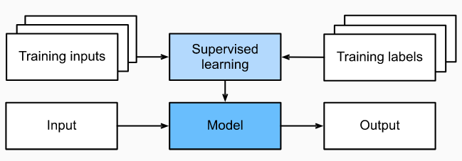

&nbsp;&nbsp;&nbsp;&nbsp;&nbsp;&nbsp;&nbsp;&nbsp;&nbsp;&nbsp;&nbsp;&nbsp;&nbsp;
Supervised learning addresses the task of predicting labels given input features. Each feature–label pair is called an example. 
Sometimes, when the context is clear, we may use the term examples to refer to a collection of inputs, even when the corresponding 
labels are unknown. Our goal is to produce a model that maps any input to a label prediction.

&nbsp;&nbsp;&nbsp;&nbsp;&nbsp;&nbsp;&nbsp;&nbsp;&nbsp;&nbsp;&nbsp;&nbsp;&nbsp;
To ground this description in a concrete example, if we were working in healthcare, then we might want to predict whether or not 
a patient would have a heart attack. This observation, “heart attack” or “no heart attack”, would be our label. The input features 
might be vital signs such as heart rate, diastolic blood pressure, and systolic blood pressure.

&nbsp;&nbsp;&nbsp;&nbsp;&nbsp;&nbsp;&nbsp;&nbsp;&nbsp;&nbsp;&nbsp;&nbsp;&nbsp;
The supervision comes into play because for choosing the parameters, we (the supervisors) provide the model with a dataset 
consisting of labeled examples, where each example is matched with the ground-truth label. In probabilistic terms, we typically 
are interested in estimating the conditional probability of a label given input features. While it is just one among several 
paradigms within machine learning, supervised learning accounts for the majority of successful applications of machine learning 
in industry. Partly, that is because many important tasks can be described crisply as estimating the probability of something
unknown given a particular set of available data:

- Predict cancer vs. not cancer, given a computer tomography image.
- Predict the correct translation in French, given a sentence in English.
- Predict the price of a stock next month based on this month’s financial reporting data.

&nbsp;&nbsp;&nbsp;&nbsp;&nbsp;&nbsp;&nbsp;&nbsp;&nbsp;&nbsp;&nbsp;&nbsp;&nbsp;
Informally, the learning process looks something like the following. First, grab a big collection of examples for which the 
features are known and select from them a random subset, acquiring the ground-truth labels for each. Sometimes these labels 
might be available data that have already been collected (e.g., did a patient die within the following year?) and other times 
we might need to employ human annotators to label the data, (e.g., assigning images to categories). Together, these inputs and 
corresponding labels comprise the training set. We feed the training dataset into a supervised learning algorithm, a function 
that takes as input a dataset and outputs another function: the learned model. Finally, we can feed previously unseen inputs
to the learned model, using its outputs as predictions of the corresponding label. See Figure 1.

 &nbsp;&nbsp;&nbsp;&nbsp;&nbsp;&nbsp;&nbsp;&nbsp;&nbsp;&nbsp;&nbsp;&nbsp;&nbsp;&nbsp;&nbsp;&nbsp;&nbsp;&nbsp; 

&nbsp;&nbsp;&nbsp;&nbsp;&nbsp;&nbsp;&nbsp;&nbsp;&nbsp;&nbsp;&nbsp;&nbsp;&nbsp;&nbsp;&nbsp;&nbsp;&nbsp;&nbsp;
&nbsp;&nbsp;&nbsp;&nbsp;&nbsp;&nbsp;&nbsp;&nbsp;&nbsp;&nbsp;&nbsp;&nbsp;&nbsp;&nbsp;&nbsp;&nbsp;&nbsp;&nbsp;
&nbsp;&nbsp;&nbsp;&nbsp;&nbsp;&nbsp;&nbsp;&nbsp;&nbsp;&nbsp;&nbsp;&nbsp;&nbsp;&nbsp;&nbsp;&nbsp;&nbsp;&nbsp;
&nbsp;&nbsp;&nbsp;&nbsp;&nbsp;*Figure 2 - Supervised Learning*

Types of Supervised Learning:

   - [Regression](https://nikolaandro.github.io/regression/)
   - [Classification](https://nikolaandro.github.io/classification/)
   - [Tagging](https://nikolaandro.github.io/tagging/)
   - Search
   - Recommender Systems
   - Sequence Learning

 &nbsp;&nbsp;&nbsp;&nbsp;&nbsp;&nbsp;&nbsp;&nbsp;&nbsp;&nbsp;&nbsp;&nbsp;&nbsp;
 The Squid
