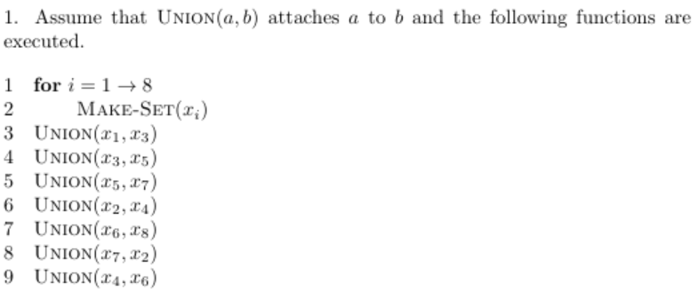
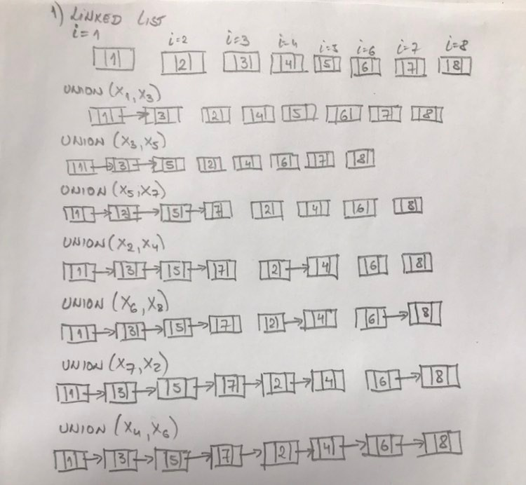

&nbsp;&nbsp;&nbsp;&nbsp;&nbsp;&nbsp;&nbsp;&nbsp;&nbsp;&nbsp;&nbsp;&nbsp;&nbsp;
Disjoint sets are the sets that have no element in common. If we were to perform an interception between two disjoint sets, we would get an empy set. 

&nbsp;&nbsp;&nbsp;&nbsp;&nbsp;&nbsp;&nbsp;&nbsp;&nbsp;&nbsp;&nbsp;&nbsp;&nbsp;
Each element of a set is represented as an object and we wish to support the following functions of the objects:

- **Make-Set(x)** - This function creates a new set whose only member is x. Since this is the matter of disjoint sets, the element x must not exist in any other set.
- **Union(x,y)** - This function unites the dynamic sets that contain x and y, which results in a new set that is usion of the two united sets. Since the sets that contained
elements x and y originally are united into a single set and since we cannot have sets with the same elements, we must destroy the original sets where x and y came from and keep the freshly produced dataset.
- **Find-Set(x)** - This function returns a pointer to the set that contains the element x.

&nbsp;&nbsp;&nbsp;&nbsp;&nbsp;&nbsp;&nbsp;&nbsp;&nbsp;&nbsp;&nbsp;&nbsp;&nbsp;
**Problem 1:**

Suppose that \text{CONNECTED-COMPONENTS}CONNECTED-COMPONENTS is run on the undirected graph G = (V, E), where V = \{a, b, c, d, e, f, g, h, i, j, k\} and the edges of E are 
processed in the order (d,i), (f,k), (g,i), (b,g), (a,h), (i,j), (d,k), (b,j), (d,f), (g,j), (a,e). 

**Solution:**
1. First, we create set with d,i edge --> make_set(d,i) = S1{d,i}
2. Repeat, S2 = {f,k}
3. Since (g,i) contains element i that is already an element of another existing set, we will perform union of htese 2 sets and remove the original set of i.

Existing sets:
- S2 = {f,k}
- S3 = {d,i,g}

4.(b,g)

Existing sets:
- S2 = {f,k}
- S4 = {d,i,g,b}

6.(a,h) 

Existing sets:
- S2 = {f,k}
- S4 = {d,i,g,b}
- S5 = {a,h}

7.(i,j)

Existing sets:
- S2 = {f,k}
- S5 = {a,h}
- S6 = {d,i,g,b,j}

8.(d,k)

Existing sets:
- S5 = {a,h}
- S7 = {d,i,g,b,j,f,k}

9.(b,j) since both elements are in the same set, this means that there is a cycle in the graph.

Existing sets:
- S5 = {a,h}
- S7 = {d,i,g,b,j,f,k}

10.(d,f) since both elements are in the same set, this means that there is a cycle in the graph.

Existing sets:
- S5 = {a,h}
- S7 = {d,i,g,b,j,f,k}

11.(g,j) since both elements are in the same set, this means that there is a cycle in the graph.

Existing sets:
- S5 = {a,h}
- S7 = {d,i,g,b,j,f,k}

12.(a,e)

Existing sets:
- S8 = {d,i,g,b,j,f,k,a,h,e}

# Linked Lists

Each set in this example can be represented using a linked list. Each member of the list contains the set member, the pointer to the next object in the list , and the pointer to the previous member in hte list.
The order of the objects in the list does not matter. 

In this case, Make_set(x) and Find_Set(x) require O(1) time. For Make_Set we just create a new linked list with the the only element x. For Find_Set(x) we just return the member variable in the object that we are pointing to. 

However, the Union(x,y) funuction would take  much longer O( $n^2$ ).

### A weighted Union Heuristic

Uion(x,y) in average takes O(n) time because we may be appending a longer list to the shorter one. What if we could always append only the shorter list to the longer one? We can do that by applying **weigted-union heiristic** where each list also includes the length of the list. Then we will always be able to append the shorter list to the longer one.

**Problem 2**

&nbsp;&nbsp;&nbsp;&nbsp;&nbsp;&nbsp;&nbsp;&nbsp;&nbsp;&nbsp;&nbsp;&nbsp;&nbsp;&nbsp;&nbsp;&nbsp;&nbsp;&nbsp; 

&nbsp;&nbsp;&nbsp;&nbsp;&nbsp;&nbsp;&nbsp;&nbsp;&nbsp;&nbsp;&nbsp;&nbsp;&nbsp;&nbsp;&nbsp;&nbsp;&nbsp;&nbsp;
&nbsp;&nbsp;&nbsp;&nbsp;&nbsp;&nbsp;&nbsp;&nbsp;&nbsp;&nbsp;&nbsp;&nbsp;&nbsp;&nbsp;&nbsp;&nbsp;&nbsp;&nbsp;
&nbsp;&nbsp;&nbsp;&nbsp;&nbsp;&nbsp;&nbsp;&nbsp;&nbsp;&nbsp;&nbsp;&nbsp;&nbsp;&nbsp;&nbsp;&nbsp;&nbsp;&nbsp;
&nbsp;&nbsp;&nbsp;&nbsp;&nbsp;*Problem 2*

Show the status of the datastructures using linked lists:

&nbsp;&nbsp;&nbsp;&nbsp;&nbsp;&nbsp;&nbsp;&nbsp;&nbsp;&nbsp;&nbsp;&nbsp;&nbsp;&nbsp;&nbsp;&nbsp;&nbsp;&nbsp; 

# Disjoint-set Forests

In this case we use trees to represent sets. When making a set, we only have the root and its value. Every other object that is being adde to the set points to its parent. Using the trees straight forward  will not improve the execution time. However, there are **two heuristics: union by rank and path compression** that can reduce the execution time. 

In this approach, Make_Set(x) crfeates a new tree with the root x. Find_Set(x) will iterate from the given node until reach the root because the root node represent the whole set. Union(x,y) causes the root of one tree to point to the root of the other tree.

### Heuristics for runtime improvement

**Union by rank** - in this approach for each node we assign a **rank** to each node. **Rank** represents the upper bound on the height of the tree. Finally, we make the root with smaller rank point to the root with the larger rank durin the Union(x,y) operation. 

**Path Compression** - this approach does not change any ranks, but rather changes to what node children point to. If there is a child of another child, the last child will point to the root. This process repeatch untill all nodes point to the root.

Show the status of the datastructures using disjoint forests with union by size and path compression:

&nbsp;&nbsp;&nbsp;&nbsp;&nbsp;&nbsp;&nbsp;&nbsp;&nbsp;&nbsp;&nbsp;&nbsp;&nbsp;&nbsp;&nbsp;&nbsp;&nbsp;&nbsp; 

&nbsp;&nbsp;&nbsp;&nbsp;&nbsp;&nbsp;&nbsp;&nbsp;&nbsp;&nbsp;&nbsp;&nbsp;&nbsp;
Nikola Andrić

 
