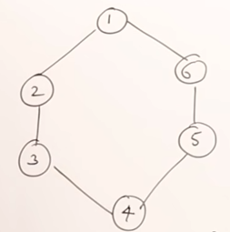
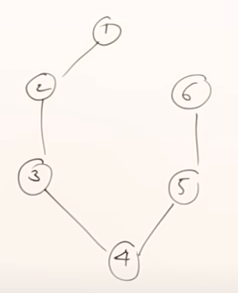
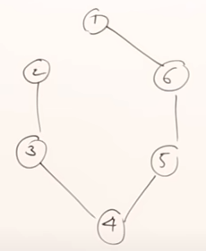

First, we must now the representation of a graph. Graph consists of vertices and edges. The graph in the following figure consists of vertices V={1,2,3,4,5,6} and endges
E = {(1,2),(2,3),(3,4),...}

&nbsp;&nbsp;&nbsp;&nbsp;&nbsp;&nbsp;&nbsp;&nbsp;&nbsp;&nbsp;&nbsp;&nbsp;&nbsp;&nbsp;&nbsp;&nbsp;&nbsp;&nbsp; 

**Spanning Tree** is an acyclic subgraph of a graph or a subset of the vertices of the original graph.  The subset of this graph can have 5 edges to connect all vertices.
 We can see that we are able to derive the spanning trees in multiple ways (some instances represented in the following photos).
 
 
 
 
 

