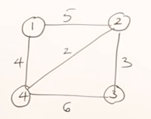
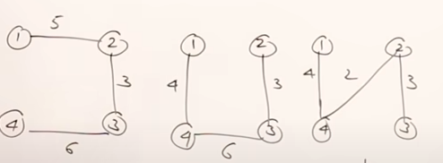
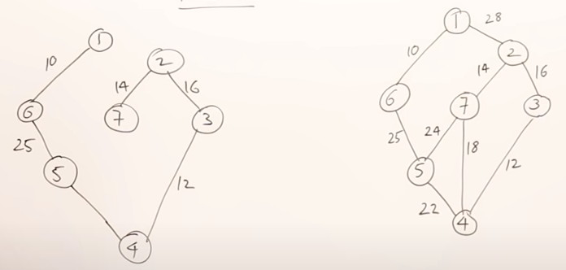

First, we must now the representation of a graph. Graph consists of vertices and edges. The graph in the following figure consists of vertices V={1,2,3,4,5,6} and endges
E = {(1,2),(2,3),(3,4),...}

&nbsp;&nbsp;&nbsp;&nbsp;&nbsp;&nbsp;&nbsp;&nbsp;&nbsp;&nbsp;&nbsp;&nbsp;&nbsp;&nbsp;&nbsp;&nbsp;&nbsp;&nbsp; 

**Spanning Tree** is an acyclic subgraph of a graph or a subset of the vertices of the original graph.  The subset of this graph can have 5 edges to connect all vertices.
 We can see that we are able to derive the spanning trees in multiple ways (some instances represented in the following photos).
 
 
 
 
 
 **Minimum Spanning Tree** is a spanning tree that has the minimum value/cost. This is being derived from the set of spanning trees of a ***weighted graph***.  Let's say we have the following graph:
 
 &nbsp;&nbsp;&nbsp;&nbsp;&nbsp;&nbsp;&nbsp;&nbsp;&nbsp;&nbsp;&nbsp;&nbsp;&nbsp;&nbsp;&nbsp;&nbsp;&nbsp;&nbsp; 
 
 
 From this graph, we can derive multiple spanning trees. Those are some of them. From the followings set of spanning trees, the minimum spanning tree is the one with the minimum weight, which is the last tree.
 
  &nbsp;&nbsp;&nbsp;&nbsp;&nbsp;&nbsp;&nbsp;&nbsp;&nbsp;&nbsp;&nbsp;&nbsp;&nbsp;&nbsp;&nbsp;&nbsp;&nbsp;&nbsp; 
 
 
 The question is "How can we find out what spanning tree has the minimum weight? Well, we can simply derive all possible spanning trees and select the one with the minimum weight. This method is pretty expensive. Can we do it better? YES! 
 
 We can do better using one of the two following algorithms:
 
 - Prim's Algorithm
 - Kruskal's Algorithm

# Prim's Algorithm

Prim's algorithm starts from the root vertex grows until it spans accross all vertices of the graph. The prpcess of choosing to which vertex to connect is simple. It chooses the vertex that has contains the edge between itself and the root that has the smallest value. For instance, in the following graph on the right side of the following image, we will start from the vertex 1. It will connect to the vertex with the edge of weight 10. The next decision is between the edges that are connected to the current spanning tree and those are (1,2) = 28 and (6,5) = 25. We pick (6,5) due to its smaller weight. We keep this process until we select all vertices of the original graph.
 
  &nbsp;&nbsp;&nbsp;&nbsp;&nbsp;&nbsp;&nbsp;&nbsp;&nbsp;&nbsp;&nbsp;&nbsp;&nbsp;&nbsp;&nbsp;&nbsp;&nbsp;&nbsp; 
 
 
 Let us see how would spanning tree grow in the following exaple:
 
 &nbsp;&nbsp;&nbsp;&nbsp;&nbsp;&nbsp;&nbsp;&nbsp;&nbsp;&nbsp;&nbsp;&nbsp;&nbsp;&nbsp;&nbsp;&nbsp;&nbsp;&nbsp; 
 
 
 Answer:
 
 &nbsp;&nbsp;&nbsp;&nbsp;&nbsp;&nbsp;&nbsp;&nbsp;&nbsp;&nbsp;&nbsp;&nbsp;&nbsp;&nbsp;&nbsp;&nbsp;&nbsp;&nbsp; 
 
 
# Kruskal's Algorithm

