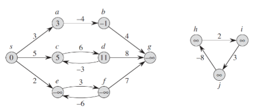

The **Shortest-paths problem** is represented as a weighted graph G = (V,E) with a weighted function w that represents metrics of the real world such as distance, time, cost
penalties, loss, etc... Hence, the shortest path between vertex **u** and vertex **v** is defined as any path **p** with minimum weight among all other paths.

The algorithm for the single source problem can solve variations of this problem such as:

- Single-destination shortest-paths problem: Find a shortest path to a given destination vertex t from each vertex v. 
- Single-pair shortest-path problem: Find a shortest path from vertex u to vertex v.
- All-pairs shortest-paths problem: Find a shortest path from vertex u to vertex v for every pair of vertices for u and v.

### Negative-weighted edges

Some graphs may include edges with negative weights. This can greatly influence the shortest path problem. However, if the negatively weighted edges form a cycle that is not reachable by "path" from vertex s to v, then that does not represent any problems.In case when the negatively weighted cycle is reachable by the path from vertex s to vertex v, that is bad because no matter how other paths are weighted, we can always to go to the negatively weighted cycle and traverse it as many times as necessary until it becomes the path with the lowest weight. In the next figure we can see the negative cycle on the right side that does not affect the shortest path since it is not connected. On the lef side we can see that if we wanted to compute the minimum weight path from s to e, we can traverse the e,f,e cycle as many times as we want to get the shortest path, which we represent as negative infinity.

&nbsp;&nbsp;&nbsp;&nbsp;&nbsp;&nbsp;&nbsp;&nbsp;&nbsp;&nbsp;&nbsp;&nbsp;&nbsp;&nbsp;&nbsp;&nbsp;&nbsp;&nbsp; 

&nbsp;&nbsp;&nbsp;&nbsp;&nbsp;&nbsp;&nbsp;&nbsp;&nbsp;&nbsp;&nbsp;&nbsp;&nbsp;&nbsp;&nbsp;&nbsp;&nbsp;&nbsp;&nbsp;&nbsp;&nbsp;&nbsp;&nbsp;&nbsp;&nbsp;&nbsp;&nbsp;&nbsp;&nbsp;&nbsp;&nbsp;&nbsp;&nbsp;&nbsp;&nbsp;&nbsp;&nbsp;&nbsp;&nbsp;&nbsp;&nbsp;&nbsp;&nbsp;&nbsp;&nbsp;&nbsp;&nbsp;&nbsp;&nbsp;&nbsp;&nbsp;&nbsp;&nbsp;&nbsp;&nbsp;&nbsp;&nbsp;&nbsp;&nbsp;*Figure 1*
