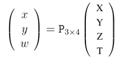
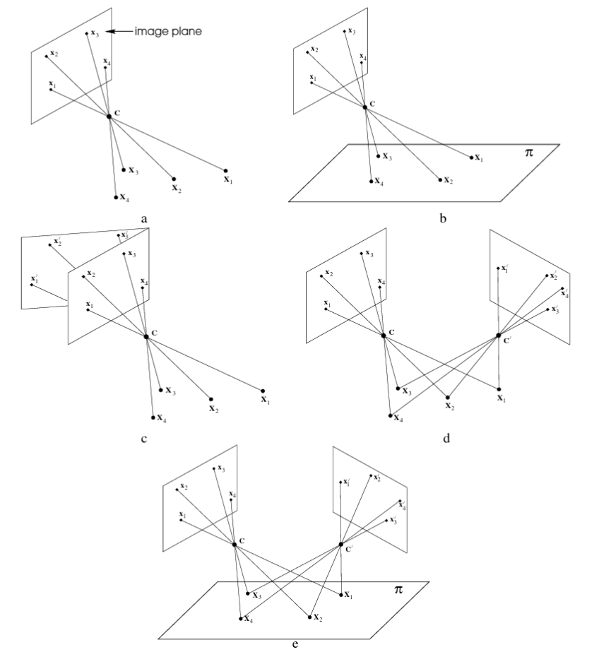
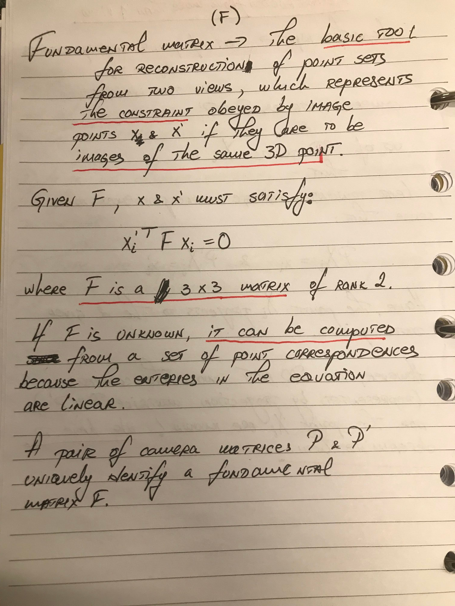
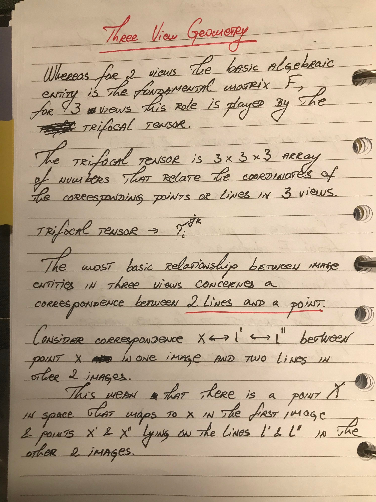
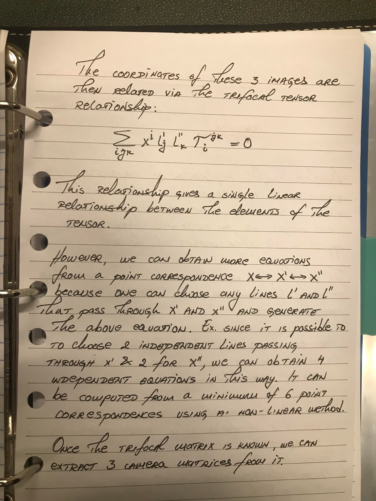
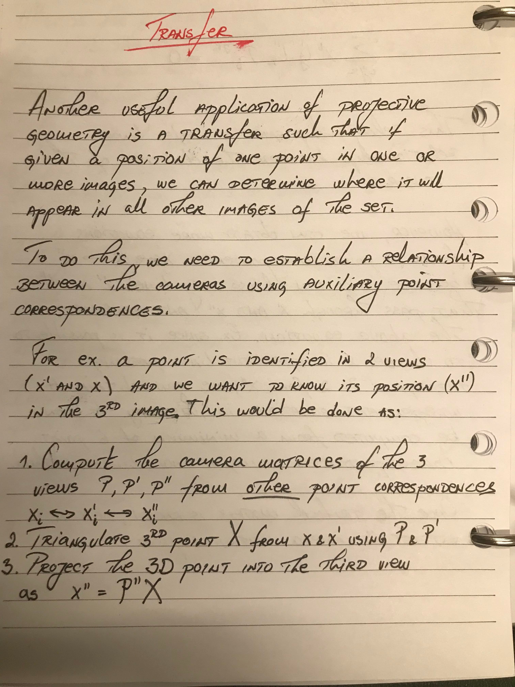

Notes taken from:

Hartley, Richard, and Andrew Zisserman. Multiple View Geometry in Computer Vision, Cambridge University Press, 2004. 
ProQuest Ebook Central, http://ebookcentral.proquest.com/lib/umr-ebooks/detail.action?docID=256634.

# Introduction

We are all familiar with projective transformations.When we look at a picture, we see squares that are not squares, or circles that are not circles. The transformation that maps these planar objects onto the picture is an example of a projective transformation.

To see why we will require projective geometry we start from the familiar Euclidean geometry. This is the geometry that describes angles and shapes of objects. Euclidean geometry is troublesome in one major respect – we need to keep making an exception to reason about some of the basic concepts of the geometry – such as intersection of lines. Two lines (we are thinking here of 2-dimensional geometry) almost always meet in a point, but there are some pairs of lines that do not do so – those that we call parallel. A common linguistic device for getting around this is to say that parallel lines meet “at in fi nity”. However this is not altogether convincing, and con fl icts with another dictum, that in fi nity does not exist, and is only a convenient fi ction. We can get around this by
enhancing the Euclidean plane by the addition of these points at in fi nity where parallel lines meet, and resolving the dif fi culty with in fi nity by calling them “ideal points.” By adding these points at in fi nity, the familiar Euclidean space is transformed into a new type of geometric object, projective space. This is a very useful way of thinking, since we are familiar with the properties of Euclidean space, involving concepts such as distances, angles, points, lines and incidence. There is nothing very mysterious about projective space – it is just an extension of Euclidean space in which two lines always meet in a point, though sometimes at mysterious points at in fi nity.

**Coordinates**. A point in Euclidean 2 -space is represented by an ordered pair of real numbers, ( x, y ) . 
We may add an extra coordinate to this pair, giving a triple ( x, y, 1) , that we declare to represent the same point. 
This seems harmless enough, since we can go back and forward from one representation of the point to the other, 
simply by adding or removing the last coordinate. We now take the important conceptual step of asking why the last
coordinate needs to be 1 – after all, the others two coordinates are not so constrained. What about a coordinate
triple ( x, y, 2) . It is here that we make a de fi nition and say that ( x, y, 1) and (2 x, 2 y, 2) represent the same point,
and furthermore, ( kx, ky, k ) represents the same point as well, for any non-zero value k . Formally, points are represented by 
**equivalence classes** of coordinate triples, where two triples are equivalent when they differ by a common multiple
. These are called the **_homogeneous coordinates_** of the point. Given a coordinate triple ( kx, ky, k ) ,
we can get the original coordinates back by dividing by k to get ( x, y ) . The reader will observe that although 
( x, y, 1) represents the same point as the coordinate pair ( x, y ) , there is no point that corresponds to the 
triple ( x, y, 0) . If we try to divide by the last coordinate, we get the point ( x/ 0 , y/ 0) which is in fi nite. 
This is how the points at in fi nity arise then. They are the points represented by homogeneous coordinates in which 
the last coordinate is zero. Once we have seen how to do this for 2-dimensional Euclidean space, extending it to a
projective space by representing points as homogeneous vectors, it is clear that we can do the same thing in any dimension.
The Euclidean space Rn  can be extended to a projective space Pn by representing points as homogeneous vectors. It turns out that the points at infinity in the two-dimensional projective space form a line, usually called the line at in fi nity . In three-dimensions they form the plane at infinity.

**Homogeneity**. In classical Euclidean geometry all points are the same. There is no distinguished point. 
The whole of the space is homogeneous. When coordinates are added, one point is seemingly picked out as the origin. 
However, it is important to realize that this is just an accident of the particular coordinate frame chosen. 
We could just as well find a **different way of coordinatizing the plane** in which a different point is considered to be the origin. 
In fact, we can consider a change of coordinates for the Euclidean space in which the **axes are shifted and rotated to a different position**. 
We may think of this in another way as the **space itself translating and rotating to a different position**. 
The resulting operation is known as a **_Euclidean transform._**

A more general type of transformation is that of applying a linear transformation
to Rn , followed by a Euclidean transformation moving the origin of the space. We may think of this as the **space moving, 
rotating and finally stretching linearly** possibly by different ratios in different directions. 
The resulting transformation is known as an **_affine transformation_**.

## Affine and Euclidean Geometry

**Affine geometry.** We will take the point of view that the projective space is initially homogeneous, with no particular coordinate frame being preferred. In such a space,
there is no concept of parallelism of lines, since parallel lines (or planes in the threedimensional case) are ones that meet at in fi nity. However, in projective space, there is no concept of which points are at in fi nity – all points are created equal. We say that parallelism is not a concept of projective geometry. It is simply meaningless to talk about it.

In order for such a concept to make sense, we need to pick out some particular line, and decide that this is the line at in fi nity. 
This results in a situation where although all points are created equal, some are more equal than others. Thus, start with a blank sheet of paper,
and imagine that it extends to in fi nity and forms a projective space IP 2 . What we see is just a small part of the space, that looks a lot like a 
piece of the ordinary Euclidean plane. Now, let us draw a straight line on the paper, and declare that this is the line at in fi nity. Next, we draw two 
other lines that intersect at this distinguished line. Since they meet at the “line at in fi nity” we de fi ne them as being parallel. The situation is 
similar to what one sees by looking at an in fi nite plane. Think of a photograph taken in a very fl at region of the earth. The points at infinity in the 
plane show up in the image as the horizon line. Lines, such as railway tracks show up in the image as lines meeting at the horizon. Points in the image 
lying above the horizon (the image of the sky) apparently do not correspond to points on the world plane. However, if we think of extending the 
corresponding ray backwards behind the camera, it will meet the plane at a point behind the camera. Thus there is a one-to-one relationship between
points in the image and points in the world plane. The points at in fi nity in the world plane correspond to a real horizon line in the image, and
parallel lines in the world correspond to lines meeting at the horizon. From our point of view, the world plane and its image are just alternative
ways of viewing the geometry of a projective plane, plus a distinguished line. **The geometry of the projective plane and a distinguished line is 
known as affine geometry and any projective transformation that maps the distinguished line in one space to the distinguished line of the other 
space is known as an** **_affine transformation _**.

By identifying a special line as the “line at in fi nity” we are able to de fi ne parallelism of straight lines in the plane.
However, certain other concepts make sense as well, as soon as we can de fi ne parallelism. For instance, we may de fi ne equalities 
of intervals between two points on parallel lines. For instance, if A , B , C and D are points, and the lines AB and CD are parallel, 
then we de fi ne the two intervals AB and CD to have equal length if the lines AC and BD are also parallel. Similarly, two intervals on 
the same line are equal if there exists another interval on a parallel line that is equal to both.

NOTE: Need a better explanation of euclidian geometry.....

**Euclidean geometry.** By distinguishing a special line in a projective plane, we gain the concept of parallelism and with it af fi ne geometry . Af fi ne geometry is seen as specialization of projective geometry, in which we single out a particular line (or plane – according to the dimension) and call it the line at in fi nity. Next, we turn to Euclidean geometry and show that by singling out some special feature of the line or plane at in fi nity af fi ne geometry becomes Euclidean geometry. In doing so, we introduce an important concept, **the absolute conic**.

We begin by considering two-dimensional geometry, and start with circles. Note that a circle is not a concept of af fi ne geometry, since arbitrary stretching of the plane, which preserves the line at in fi nity, turns the circle into an ellipse. Thus, af fi ne geometry does not distinguish between circles and ellipses.

In Euclidean geometry however, they are distinct, and have an important difference. Algebraically, an ellipse is described by a second-degree equation. It is therefore expected, and true that two ellipses will most generally intersect in four points. However, it is geometrically evident that two distinct circles can not intersect in more than two points. Algebraically, we are intersecting two second-degree curves here, or equivalently solving two quadratic equations. We should expect to get four solutions. The question is, what is special about circles that they only intersect in two points.

The answer to this question is of course that there exist two other solutions, the two circles meeting in two other complex points. We do not have to look very far to fi nd these two points.

The equation for a circle in homogeneous coordinates ( x, y, w ) is of the form:

( x − aw )2 + ( y − bw )2 = r2 w2

## Camera Projections

The drop from three-dimensional world to a two-dimensional image is a projection process in which we lose one dimension. 
The usual way of modelling this process is by **central projection** in which a ray from a point in space is drawn from a 
3D world point through a fixed point in space, **the centre of projection** . This ray will intersect a specific plane in 
space chosen as **the image plane** . The intersection of the ray with the
image plane represents the image of the point. If the 3D structure lies on a plane then there is no drop in dimension.

This model is in accord with a simple model of a camera, in which a ray of light from a point in the world passes through the lens of a camera and impinges on a fi lm or digital device, producing an image of the point. Ignoring such effects as focus and lens thickness, a reasonable approximation is that all the rays pass through a single point, the centre of the lens.

In applying projective geometry to the imaging process, it is customary to model the world as a **3D projective space, 
equal to R3** along with points at infinity. Similarly the model for **the image is the 2D projective plane P2** .
written in terms of homogeneous coordinates ( X , Y , T )T and let the centre of projection be the origin (0, 0 , 0 , 1)T , 
then we see that the set of all points ( X , Y , Z , T )T for fixed X , Y and Z , but varying T form a single ray passing through the point
centre of projection, and hence all mapping to the same point. 
Thus, the final coordinate of ( X , Y , Z , T ) is irrelevant to where the point is imaged. 
In fact, the image point is the point in P2 with homogeneous coordinates ( X , Y , Z )T . 
Thus, the mapping may be represented by a mapping of 3D homogeneous coordinates,
represented by a 3 × 4 matrix P with the block structure P = [ I3 × 3 | 03 ] , where I3 × 3 is the 3 × 3 identity matrix
and 03 a zero 3-vector. Making allowance for a different centre of projection, 
and a different projective coordinate frame in the image, it turns out that the most general imaging projection 
is represented by an arbitrary **3 × 4 matrix of rank 3**, acting on the homogeneous coordinates of the point in P3 mapping it to 
the imaged point in P2 . This matrix P is known as **the camera matrix**.

In summary, the action of a projective camera on a point in space may be expressed in terms of a linear mapping of homogeneous coordinates as

 &nbsp;&nbsp;&nbsp;&nbsp;&nbsp;&nbsp;&nbsp;&nbsp;&nbsp;&nbsp;&nbsp;&nbsp;&nbsp;&nbsp;&nbsp;&nbsp;&nbsp;&nbsp; 

Furthermore, if all the points lie on a plane (we may choose this as the plane Z = 0 ) then the linear mapping reduces to:

 &nbsp;&nbsp;&nbsp;&nbsp;&nbsp;&nbsp;&nbsp;&nbsp;&nbsp;&nbsp;&nbsp;&nbsp;&nbsp;&nbsp;&nbsp;&nbsp;&nbsp;&nbsp; 

which is **a projective transformation.**

**Cameras as points. ** 

 &nbsp;&nbsp;&nbsp;&nbsp;&nbsp;&nbsp;&nbsp;&nbsp;&nbsp;&nbsp;&nbsp;&nbsp;&nbsp;&nbsp;&nbsp;&nbsp;&nbsp;&nbsp; 

The camera centre is the essence. (a) Image formation: the image points xi are the intersection of a plane with rays from the space points Xi through the camera centre C . (b) If the space points are coplanar then there is a projective transformation between the world and image planes, xi = H3x3 . (c) All images with the same camera centre are related by a projective transformation, xi = H3x3 xi . Compare (b) and (c) – in both cases planes are mapped to one another by rays through a centre. In (b) the mapping is between a scene and image plane, in (c) between two image planes. (d) If the camera centre moves, then the images are in general not related by a projective transformation, unless (e) all the space points are coplanar. 

## 3D reconstructions from images

Using techniques of projective geometry, it is possible in many instances to reconstruct scenes from a single image. This cannot be done without some assumptions being made about the imaged scene. Typical techniques involve the analysis of features such as parallel lines and vanishing points to determine the af fi ne structure of the scene, for
example by determining the line at in fi nity for observed planes in the image. Knowledge (or assumptions) about angles observed in the scene, most particularly orthogonal lines or planes, can be used to upgrade the af fi ne reconstruction to Euclidean. It is not yet possible for such techniques to be fully automatic. However, projective geometric knowledge may be built into a system that allows user-guided single-view reconstruction of the scene. Such techniques have been used to reconstruct 3D texture mapped graphical models derived from old-master paintings. Starting in the Renaissance, paintings with extremely accurate perspective were produced. In the following figure a reconstruction carried out from such a painting is shown.

 &nbsp;&nbsp;&nbsp;&nbsp;&nbsp;&nbsp;&nbsp;&nbsp;&nbsp;&nbsp;&nbsp;&nbsp;&nbsp;&nbsp;&nbsp;&nbsp;&nbsp;&nbsp; 

Single view reconstruction. (a) Original painting – St. Jerome in his study, 1630, Hendrick van Steenwijck (1580-1649), Joseph R. Ritman Private Collection, Amsterdam, The Netherlands. (b) (c)(d) Views of the 3D model created from the painting. Figures courtesy of Antonio Criminisi.

## Reconstruction from more than 1 view

