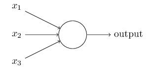

# History
 
 &nbsp;&nbsp;&nbsp;&nbsp;&nbsp;&nbsp;&nbsp;&nbsp;&nbsp;&nbsp;&nbsp;&nbsp;&nbsp;
 The idea of the **artificial neural networks** was born in 1940's, but began to be efficient around 2011 when it outperformed support vector machines (SVMs).
 
 
# Basic Idea

 &nbsp;&nbsp;&nbsp;&nbsp;&nbsp;&nbsp;&nbsp;&nbsp;&nbsp;&nbsp;&nbsp;&nbsp;&nbsp;
 The main idea behind the artificial neural networks is to ***mimic a neuron in the brain***. Basic components are ***dendrites, a nucleus, an axon, and axon terminals***. Neurons transmit/transport information using ***synapse (a bridge between axon terminals of one neuron and dentrites on another neuron.)***
 
  &nbsp;&nbsp;&nbsp;&nbsp;&nbsp;&nbsp;&nbsp;&nbsp;&nbsp;&nbsp;&nbsp;&nbsp;&nbsp;&nbsp;&nbsp;&nbsp;&nbsp;&nbsp; 

&nbsp;&nbsp;&nbsp;&nbsp;&nbsp;&nbsp;&nbsp;&nbsp;&nbsp;&nbsp;&nbsp;&nbsp;&nbsp;&nbsp;&nbsp;&nbsp;&nbsp;&nbsp;&nbsp;&nbsp;&nbsp;&nbsp;&nbsp;&nbsp;&nbsp;&nbsp;&nbsp;&nbsp;&nbsp;&nbsp;&nbsp;&nbsp;&nbsp;&nbsp;&nbsp;&nbsp;&nbsp;&nbsp;&nbsp;&nbsp;&nbsp;&nbsp;&nbsp;&nbsp;&nbsp;&nbsp;&nbsp;&nbsp;&nbsp;&nbsp;&nbsp;&nbsp;&nbsp;&nbsp;&nbsp;&nbsp;&nbsp;&nbsp;&nbsp;*Figure 1 - Neurons*

 &nbsp;&nbsp;&nbsp;&nbsp;&nbsp;&nbsp;&nbsp;&nbsp;&nbsp;&nbsp;&nbsp;&nbsp;&nbsp;
 In the Figure 2, we can see how computer scientists mimic this:
 
 &nbsp;&nbsp;&nbsp;&nbsp;&nbsp;&nbsp;&nbsp;&nbsp;&nbsp;&nbsp;&nbsp;&nbsp;&nbsp;&nbsp;&nbsp;&nbsp;&nbsp;&nbsp; 

&nbsp;&nbsp;&nbsp;&nbsp;&nbsp;&nbsp;&nbsp;&nbsp;&nbsp;&nbsp;&nbsp;&nbsp;&nbsp;&nbsp;&nbsp;&nbsp;&nbsp;&nbsp;&nbsp;&nbsp;&nbsp;&nbsp;&nbsp;&nbsp;&nbsp;&nbsp;&nbsp;&nbsp;&nbsp;&nbsp;&nbsp;&nbsp;&nbsp;&nbsp;&nbsp;&nbsp;&nbsp;&nbsp;&nbsp;&nbsp;&nbsp;&nbsp;&nbsp;&nbsp;&nbsp;&nbsp;&nbsp;&nbsp;&nbsp;&nbsp;&nbsp;&nbsp;&nbsp;&nbsp;&nbsp;&nbsp;&nbsp;&nbsp;&nbsp;*Figure 2 - Artifician Neural Network Structure*
 
# Perceptrons

What is a neural network? To get started, I'll explain a type of artificial neuron called a perceptron. Perceptrons were developed in the 1950s and 1960s by the scientist Frank Rosenblatt, inspired by earlier work by Warren McCulloch and Walter Pitts. Today, it's more common to use other models of artificial neurons - in this book, and in much modern work on neural networks, the main neuron model used is one called the sigmoid neuron. We'll get to sigmoid neurons shortly. But to understand why sigmoid neurons are defined the way they are, it's worth taking the time to first understand perceptrons.

So how do perceptrons work? A perceptron takes several binary inputs, x1,x2,…, and produces a single binary output:

 &nbsp;&nbsp;&nbsp;&nbsp;&nbsp;&nbsp;&nbsp;&nbsp;&nbsp;&nbsp;&nbsp;&nbsp;&nbsp;&nbsp;&nbsp;&nbsp;&nbsp;&nbsp; 

In the example shown the perceptron has three inputs, x1,x2,x3. In general it could have more or fewer inputs. Rosenblatt proposed a simple rule to compute the output. He introduced weights, w1,w2,…, real numbers expressing the importance of the respective inputs to the output. The neuron's output, 0 or 1, is determined by whether the weighted sum ∑jwjxj is less than or greater than some threshold value. Just like the weights, the threshold is a real number which is a parameter of the neuron.

 &nbsp;&nbsp;&nbsp;&nbsp;&nbsp;&nbsp;&nbsp;&nbsp;&nbsp;&nbsp;&nbsp;&nbsp;&nbsp;&nbsp;&nbsp;&nbsp;&nbsp;&nbsp; 

Incidentally, when I defined perceptrons I said that a perceptron has just a single output. In the network above the perceptrons look like they have multiple outputs. In fact, they're still single output. The multiple output arrows are merely a useful way of indicating that the output from a perceptron is being used as the input to several other perceptrons. It's less unwieldy than drawing a single output line which then splits.

Let's simplify the way we describe perceptrons. The condition ∑jwjxj>threshold is cumbersome, and we can make two notational changes to simplify it. The first change is to write ∑jwjxj as a dot product, w⋅x≡∑jwjxj, where w and x are vectors whose components are the weights and inputs, respectively. **The second change is to move the threshold to the other side of the inequality, and to replace it by what's known as the perceptron's bias, b≡−threshold.** Using the bias instead of the threshold, the perceptron rule can be rewritten:

 &nbsp;&nbsp;&nbsp;&nbsp;&nbsp;&nbsp;&nbsp;&nbsp;&nbsp;&nbsp;&nbsp;&nbsp;&nbsp;&nbsp;&nbsp;&nbsp;&nbsp;&nbsp; 

You can think of the bias as a measure of how easy it is to get the perceptron to output a 1. Or to put it in more biological terms, the bias is a measure of how easy it is to get the perceptron to fire. For a perceptron with a really big bias, it's extremely easy for the perceptron to output a 1. But if the bias is very negative, then it's difficult for the perceptron to output a 1.

# Sigmoid Neurons

 &nbsp;&nbsp;&nbsp;&nbsp;&nbsp;&nbsp;&nbsp;&nbsp;&nbsp;&nbsp;&nbsp;&nbsp;&nbsp;
 Nikola Andrić

 
